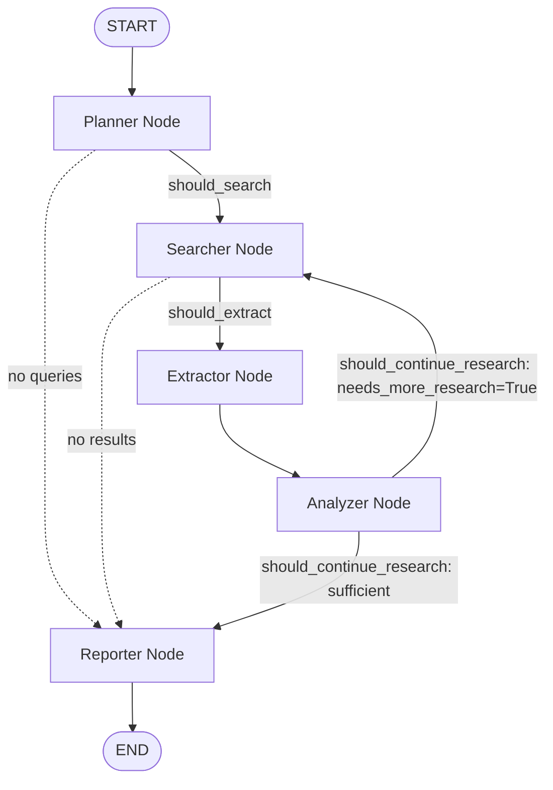

# Autonomous AI Research Agent

An autonomous research system built with LangGraph, LangChain, OpenRouter, and FastAPI. The agent accepts a complex research query, formulates an investigation plan, conducts web searches across multiple sources, extracts web page content in parallel, performs cross-source evidence analysis, and generates a structured research report with inline citations.

---

## System Architecture

```
Research Agent/
├── backend/
│   ├── main.py                # Application entry point (Uvicorn ASGI server)
│   ├── requirements.txt       # Dependencies (langgraph, tavily-python, trafilatura, etc.)
│   ├── config/
│   │   └── settings.py        # Centralized Pydantic Settings configuration manager
│   ├── services/
│   │   └── llm_service.py     # OpenRouter LLM initialization & structured output binding
│   ├── state/
│   │   └── research_state.py  # TypedDict and Pydantic models for graph state management
│   ├── tools/
│   │   ├── web_search.py      # Tavily Web Search tool integration
│   │   ├── webpage_reader.py  # Concurrent multi-threaded content scraper
│   │   └── citation_formatter.py # Reference list generator and citation de-duplication
│   ├── prompts/
│   │   ├── planner_prompts.py # Prompts for question decomposition
│   │   ├── analyzer_prompts.py# Prompts for single-pass multi-source analysis
│   │   └── reporter_prompts.py# Prompts for final report generation
│   ├── nodes/
│   │   ├── planner.py         # Research planning & sub-query generation node
│   │   ├── searcher.py        # Web search execution node
│   │   ├── extractor.py       # Parallel content extraction node
│   │   ├── analyzer.py        # Evidence analysis & cross-source comparison node
│   │   └── reporter.py        # Markdown report generation node
│   ├── graph/
│   │   ├── routing.py         # Conditional edge routing rules
│   │   └── research_graph.py  # Compiled StateGraph with MemorySaver checkpointer
│   ├── api/
│   │   ├── app.py             # FastAPI app factory with CORS & static files
│   │   ├── models/
│   │   │   └── requests.py    # API request and response models
│   │   └── routes/
│   │       └── research.py    # SSE streaming endpoint (/api/research)
│   └── tests/
│       ├── test_state.py      # State model unit tests
│       ├── test_tools.py      # Citation formatter tests
│       ├── test_nodes.py      # Routing logic unit tests
│       └── test_graph.py      # StateGraph compilation test
└── frontend/
    ├── index.html             # HTML5 web interface
    ├── css/styles.css         # Dark theme styling, glassmorphism, animations
    └── js/app.js              # Real-time SSE streaming client & Markdown renderer
```

---

## Agent Workflow

The system operates as a stateful, event-driven graph powered by LangGraph.

```
       [User Query]
            │
            ▼
    ┌──────────────┐
    │ Planner Node │ ── (Formulates objective, approach & 2-3 search queries)
    └──────┬───────┘
           │
           ▼
    ┌──────────────┐
    │ Searcher Node│ ── (Executes web searches via Tavily API & de-duplicates URLs)
    └──────┬───────┘
           │
           ▼
   ┌────────────────┐
   │ Extractor Node │ ── (Fetches webpage content in parallel via ThreadPoolExecutor)
   └───────┬────────┘
           │
           ▼
   ┌────────────────┐
   │ Analyzer Node  │ ── (Performs single-pass source summarization & comparison)
   └───────┬────────┘
           │
           ├─────────────────────────┐
           │ (Needs More Research?)  │
           ▼                         ▼
   ┌────────────────┐       ┌──────────────┐
   │ Searcher Node  │       │Reporter Node │ ── (Generates cited Markdown report)
   └────────────────┘       └──────┬───────┘
                                   │
                                   ▼
                            [Final Report]
```

### Execution Steps:
1. **Planning**: The `Planner` breaks down the user request into 2–3 targeted sub-questions and optimizes keyword queries.
2. **Searching**: The `Searcher` queries external sources using Tavily Search API and de-duplicates resulting links.
3. **Extracting**: The `Extractor` downloads and parses web pages concurrently, trimming noise and extracting main article text.
4. **Analyzing**: The `Analyzer` runs a single-pass evaluation across all extracted text to identify consensus points, contradictions, and unique insights.
5. **Reporting**: The `Reporter` synthesizes all verified facts into a structured Markdown document with inline citation markers `[1]`, `[2]` and appends a References section.

---

## LangGraph StateGraph Architecture

The orchestration engine is constructed as a stateful graph using LangGraph's `StateGraph`.

### 1. Mermaid StateGraph Visualization



### 2. State Schema Design (`ResearchState`)

The state schema is defined as a Python `TypedDict` with reducer functions (`operator.add`) for accumulating list fields across graph iterations.

```python
from typing import TypedDict, Annotated, Optional
import operator

class ResearchState(TypedDict, total=False):
    # Input
    user_query: str
    
    # Planning
    research_plan: Optional[ResearchPlan]
    search_queries: list[str]
    
    # Search & Extraction (Reducers append new items across iterations)
    search_results: Annotated[list[SearchResult], operator.add]
    extracted_content: Annotated[list[ExtractedContent], operator.add]
    
    # Analysis & Reporting
    source_summaries: list[SourceSummary]
    analysis: Optional[AnalysisResult]
    citations: list[Citation]
    final_report: str
    
    # Execution Tracking (Reducers append logs and errors)
    status: str
    current_iteration: int
    errors: Annotated[list[str], operator.add]
    execution_log: Annotated[list[str], operator.add]
```

### 3. StateGraph Compilation & Conditional Edge Routing

```python
from langgraph.graph import StateGraph, END
from langgraph.checkpoint.memory import MemorySaver

# 1. Initialize StateGraph with state schema
workflow = StateGraph(ResearchState)

# 2. Add Graph Nodes
workflow.add_node("planner", planner_node)
workflow.add_node("searcher", searcher_node)
workflow.add_node("extractor", extractor_node)
workflow.add_node("analyzer", analyzer_node)
workflow.add_node("reporter", reporter_node)

# 3. Set Entry Point
workflow.set_entry_point("planner")

# 4. Add Conditional Edges for Dynamic Routing
workflow.add_conditional_edges("planner", should_search, {"searcher": "searcher", "reporter": "reporter"})
workflow.add_conditional_edges("searcher", should_extract, {"extractor": "extractor", "reporter": "reporter"})
workflow.add_edge("extractor", "analyzer")
workflow.add_conditional_edges("analyzer", should_continue_research, {"searcher": "searcher", "reporter": "reporter"})
workflow.add_edge("reporter", END)

# 5. Compile Graph with Checkpointer
checkpointer = MemorySaver()
research_graph = workflow.compile(checkpointer=checkpointer)
```

---

## Performance Optimizations & Benchmarks

The graph architecture was optimized to minimize token consumption and reduce end-to-end execution latency without sacrificing report accuracy.

| Metric | Original System | Optimized System | Improvement |
|---|:---:|:---:|:---:|
| **Total Token Usage** | ~32,300 tokens | **~4,500 – 6,000 tokens** | **~82% Reduction** |
| **LLM API Invocations** | 10 – 14 calls | **3 calls total** | **~75% Reduction** |
| **Page Extraction Latency** | 20 – 30 seconds | **~2 seconds** | **10x Acceleration** |
| **Analysis Node Latency** | ~30 seconds | **~4 seconds** | **7.5x Acceleration** |
| **Citations Generated** | 50+ raw references | **3 – 6 cited sources** | **High Precision** |
| **End-to-End Runtime** | 60 – 120 seconds | **10 – 15 seconds** | **~85% Reduction** |

### Key Optimizations Applied:
- **Parallel Multi-Threaded Scraping**: Implemented `ThreadPoolExecutor` in `webpage_reader.py` for concurrent HTTP fetching.
- **Single-Pass Structured Analysis**: Combined individual source summarization and cross-source comparison into a single structured Pydantic model (`CombinedAnalysis`), reducing LLM calls in the Analyzer node from `N+1` to **1**.
- **Context Window Trimming**: Capped extracted text length per webpage at 3,500 characters (~550 words), removing non-essential text before LLM context insertion.
- **Query & Sub-question Capping**: Limited planner output to 2–3 targeted sub-questions and restricted maximum web search results to 3 per query.

---

## Core Features

- **Autonomous Multi-Step Reasoning**: Plans before acting and dynamically evaluates if additional information is required.
- **Concurrent Web Content Scraping**: Multi-threaded extraction using Trafilatura with BeautifulSoup HTML fallback.
- **Fact Verification & Contradiction Detection**: Cross-references findings across sources to identify consensus and conflicting data points.
- **Inline Citation Management**: Formats cited claims with numbered markers `[N]` linked to a de-duplicated References section.
- **Real-Time Progress Streaming (SSE)**: Streams node status and intermediate logs to the web interface via Server-Sent Events.
- **Production-Ready Web Dashboard**: Clean dark-mode interface with live execution pipeline tracking and client-side Markdown rendering.

---

## Technology Stack

- **Orchestration**: LangGraph
- **LLM Framework**: LangChain
- **LLM Provider**: OpenRouter (Supports models such as `google/gemma-3-27b-it:free`, `meta-llama/llama-3.3-70b-instruct:free`, `qwen/qwen-2.5-72b-instruct:free`)
- **Backend API**: FastAPI / Uvicorn
- **Search Provider**: Tavily Search API
- **Scraping Engine**: Trafilatura & BeautifulSoup4
- **State Validation**: Pydantic v2 & Pydantic Settings
- **Frontend**: Vanilla HTML5, CSS3, JavaScript (SSE client Parser + Marked.js)

---

## Setup & Installation

### 1. Prerequisites
- Python 3.10+
- OpenRouter API Key (free tier available at [openrouter.ai/keys](https://openrouter.ai/keys))
- Tavily Search API Key (free tier available at [tavily.com](https://tavily.com))

### 2. Environment Configuration
Create a `.env` file in the root directory:

```env
OPENROUTER_API_KEY=your_openrouter_api_key_here
OPENROUTER_MODEL=google/gemma-3-27b-it:free
OPENROUTER_BASE_URL=https://openrouter.ai/api/v1

TAVILY_API_KEY=your_tavily_api_key_here

APP_PORT=8000
LOG_LEVEL=INFO

MAX_SEARCH_RESULTS=3
MAX_PAGES_TO_READ=3
MAX_RESEARCH_ITERATIONS=1
```

### 3. Install Dependencies
```powershell
python -m venv venv
.\venv\Scripts\pip install -r backend/requirements.txt
```

### 4. Run Automated Tests
```powershell
.\venv\Scripts\pytest backend/tests/ -v
```

### 5. Launch Application Server
```powershell
.\venv\Scripts\python backend/main.py
```

Access the web portal by visiting `http://localhost:8000` in your web browser.

---

## Future Roadmap & Planned Enhancements

### 1. Document Export Engine (PDF & DOCX)

### 2. Advanced UI/UX & Web Dashboard Upgrades

### 3. Multi-Agent & Storage Extensions


---

## License
Distributed under the MIT License. See `LICENSE` for more information.
